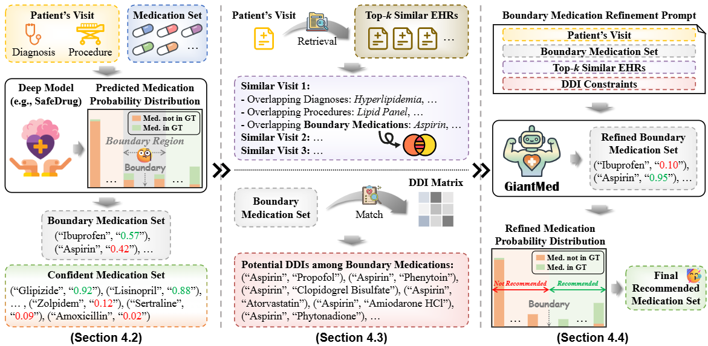

<div align="center">

<h2>Awaken the Giant: Activating LLMs via Deep Model Guidance for Boundary-aware Medication Recommendation</h2>

<p><strong>Accepted at KDD 2026</strong></p>

<p>
<strong>Hang Lv<sup>1</sup>, Zixuan Guo<sup>1</sup>, Yanchao Tan<sup>1,*</sup>, Wanzi Shao<sup>1</sup>, Hengyu Zhang<sup>2</sup>, Carl Yang<sup>3</sup></strong>
</p>


<p>
<sup>1</sup>Fuzhou University &nbsp;&nbsp;
<sup>2</sup>Macquarie University &nbsp;&nbsp;
<sup>3</sup>Emory University
</p>

<p><sup>*</sup>Corresponding author</p>

[](https://dl.acm.org/doi/abs/10.1145/3770854.3780297)
[](https://github.com/lvhangkenn/GiantMed)


</div>
The code is currently being refined and will be updated soon.

## 📖 Abstract

Accurate and safe medication recommendations from Electronic Health Records (EHRs) are essential for clinical decision support. While Large Language Models (LLMs) have shown strong semantic reasoning capabilities in healthcare, they tend to make coarse binary predictions, overlooking medications near the decision boundary and leading to overprescription. In contrast, deep models offer fine-grained probability outputs but lack the contextual reasoning needed for complex boundary cases.

To address this, we propose a boundary-aware medication recommendation framework (**GiantMed**) that activates the potential of the LLM "giant" under deep-model guidance. Specifically, GiantMed leverages a deep model to identify boundary medications and directs the LLM to focus on these clinically ambiguous yet informative cases. Furthermore, we augment the contextual knowledge of boundary medications by retrieving relevant historical EHRs and integrating Drug–Drug Interaction (DDI) constraints. The final recommendation is generated by incorporating the LLM-refined boundary medications with confident predictions from the deep model.

Extensive experiments on two real-world EHR datasets demonstrate that GiantMed achieves state-of-the-art accuracy while reducing DDI rates.

## 🏗️ Framework

<p align="center">
  
</p>

## 🗂️ Dataset Access

> In accordance with the data-use requirements of the PhysioNet Clinical Databases, we are unable to redistribute the datasets without prior approval.

Researchers may request access through the corresponding PhysioNet pages:

- [MIMIC-III Clinical Database v1.4](https://physionet.org/content/mimiciii/1.4/)
- [MIMIC-IV Clinical Database v2.2](https://physionet.org/content/mimiciv/2.2/)

## ⚡ Quick Start

The prompt JSON file has already existed. You can skip the full pipeline and run the LLM refinement stage directly with the standalone inference script.

```bash
cd GiantMed/LLM
python LLM_QuickStart.py
```

This script provides a lightweight entry point for LLM inference. It directly:

1. loads an existing prompt file (e.g., `MedAlign_prompts.json`);
2. loads the Qwen3-8B model;
3. performs LLM-based medication refinement;
4. saves the generated recommendations to a JSON file (e.g., `MedAlign_output.json`).

Before running the script, configure the following variables in `QuickStart.py` according to your environment:

```python
MODEL_PATH = "/path/to/Qwen3-8B"
CUDA_DEVICE = "0"

PROMPTS_JSON_PATH = "LLM-data/MedAlign_prompts.json"
OUTPUT_JSON_PATH = "/LLM/MedAlign_output.json"

MAX_SAMPLES = None  # Set to None for the full dataset, or use a list such as [100, 200, 300...] for small-sample testing.
```

> Use `QuickStart.py` for a quick standalone test when prompt files are already available. For the complete and reproducible GiantMed workflow, we recommend using `main.py` as described below.

## 🚀 Full pipeline

### Step 1 — Install Dependencies

The main package versions used in our experiments are:

```text
pandas==1.3.0
dill==0.3.4
torch==1.8.0
rdkit==2021.03.4
scikit-learn==0.24.2
numpy==1.21.1
transformers==4.51.0
```

MoleRec additionally requires PyTorch Geometric and OGB. MedAlign additionally requires the Python Optimal Transport package (`POT`). Please install versions compatible with your PyTorch and CUDA environment.

### Step 2 — Preprocess the EHR Data

Place the authorized raw MIMIC files and medication mapping files under `data/raw/`, and then run:

```bash
cd data
python process.py
```

<details>
<summary><strong>📁 Expected raw-data structure</strong></summary>

```text
data/
└── raw/
    ├── DIAGNOSES_ICD.csv
    ├── PRESCRIPTIONS.csv
    ├── PROCEDURES_ICD.csv
    ├── drug-atc.csv
    ├── drug-DDI.csv
    ├── idx2SMILES.pkl
    ├── ndc2atc_level4.csv
    └── ndc2RXCUI.txt
```

</details>

<details>
<summary><strong>📁 Processed-data structure</strong></summary>

```text
data/
└── ready/
    ├── atc3toSMILES.pkl
    ├── ddi_A_final.pkl
    ├── ddi_mask_H.pkl
    ├── drug_smile.pkl
    ├── drug_text_embs.pkl
    ├── ehr_adj_final.pkl
    ├── records_final.pkl
    ├── smile_sub_b.pkl
    ├── smile_sub_degree_b.pkl
    ├── smile_sub_recency_b.pkl
    ├── smile_sub_voc_b.pkl
    ├── smile_sub.pkl
    └── voc_final.pkl
```

</details>

### Step 3 — Generate Deep-Model Probabilities

The released checkpoints and inference code for SafeDrug, MoleRec, DEPOT, and MedAlign are provided directly under `Deep_Model/`.

The directory structure is:

```text
GiantMed/
├── data/
├── Deep_Model/
│   ├── model/
│   ├── modules/
│   ├── ckpt_DEPOT.model
│   ├── ckpt_MedAlign.model
│   ├── ckpt_MoleRec.model
│   ├── ckpt_SafeDrug.model
│   ├── config.py
│   ├── main_DEPOT.py
│   ├── main_MedAlign.py
│   ├── main_MoleRec.py
│   ├── main_SafeDrug.py
│   ├── trainer_DEPOT.py
│   ├── trainer_MedAlign.py
│   ├── training_MoleRec.py
│   ├── util.py
│   ├── util_MoleRec.py
│   └── utils.py
├── Figure/
├── LLM/
├── LLM-data/
└── README.md
```

Each `main_*.py` script loads the corresponding released checkpoint, performs visit-level inference, and directly generates the medication-probability file required by the subsequent LLM refinement stage.

Run the desired deep model from the `Deep_Model/` directory:

```bash
cd GiantMed/Deep_Model

# SafeDrug
python main_SafeDrug.py

# MoleRec
python main_MoleRec.py

# DEPOT
python main_DEPOT.py

# MedAlign
python main_MedAlign.py
```

The corresponding prediction files are saved under `LLM-data/`:

```text
GiantMed/LLM-data/
├── SafeDrug_predictions.json
├── MoleRec_predictions.json
├── DEPOT_predictions.json
└── MedAlign_predictions.json
```

For example, running:

```bash
python main_MoleRec.py
```

generates:

```text
GiantMed/LLM-data/MoleRec_predictions.json
```

The generated prediction files follow the format below:

```json
[
  {
    "patient_id": 0,
    "visits": [
      {
        "visit_id": 0,
        "actual": [1, 5, 10],
        "predicted": [
          [10, 0.9273410439491272],
          [5, 0.8912528157234192],
          [35, 0.7821558713912964]
        ]
      }
    ]
  }
]
```

Here, `actual` contains the ground-truth medication IDs for the current visit, while `predicted` contains `[medication_id, probability]` pairs sorted by predicted probability in descending order.

> Before running a deep model, make sure that its checkpoint and processed dataset use the same vocabulary and dataset setting.

### Step 5 — Run LLM Refinement

The Similar-EHR and DDI evidence files required by GiantMed are already provided in `LLM-data/`. Therefore, no additional Similar-EHR retrieval or DDI evidence construction is required.

After generating the deep-model probability file in Step 3, run the LLM refinement pipeline:

```bash
cd GiantMed/LLM

python main.py --model SafeDrug
python main.py --model MoleRec
python main.py --model DEPOT
python main.py --model MedAlign
```

Use the same model in Step 3 and Step 5. For example:

```bash
cd GiantMed/Deep_Model
python main_MoleRec.py

cd ../LLM
python main.py --model MoleRec
```

The LLM component contains two stages:

| Stage | Function | Output |
|---|---|---|
| Stage 1 | `build_prompts()` | `{Model}_prompts.json` |
| Stage 2 | `run_inference()` | `{Model}_output.json` |

<details>
<summary><strong>📁 LLM module structure</strong></summary>

```text
GiantMed/
├── LLM/
│   ├── config.py
│   ├── LLM_Recommend.py
│   ├── main.py
│   ├── Prompt_for_Refinement.py
│   ├── QuickStart.py
│   └── utils.py
└── LLM-data/
    ├── code_mapping.json
    ├── records_train.pkl
    ├── records_valid.pkl
    ├── similar_EHRs.json
    ├── ddi_report.txt
    ├── SafeDrug_predictions.json
    ├── MoleRec_predictions.json
    ├── DEPOT_predictions.json
    └── MedAlign_predictions.json
```

</details>

<details>
<summary><strong>⚙️ LLM command-line options</strong></summary>

| Flag | Default | Description |
|---|---|---|
| `--model` | Required | `SafeDrug`, `MoleRec`, `DEPOT`, or `MedAlign` |
| `--skip-prompts` | Off | Load an existing `{Model}_prompts.json` |
| `--prompts-only` | Off | Build prompts without running LLM inference |
| `--llm-path PATH` | `/LLM/Qwen3-8B` | Path to the LLM checkpoint |
| `--cuda-device N` | `0` | Value assigned to `CUDA_VISIBLE_DEVICES` |
| `--debug` | Off | Print the first generated prompt |

```bash
# Re-run only LLM inference using existing prompts
python main.py --model SafeDrug --skip-prompts

# Build prompts first and run inference separately
python main.py --model SafeDrug --prompts-only
python main.py --model SafeDrug --skip-prompts

# Use a custom LLM checkpoint on GPU 1
python main.py \
  --model MoleRec \
  --cuda-device 1 \
  --llm-path /path/to/model
```

</details>

## 🧠 Deep-Model Entry Points

The released checkpoints can be used directly with the corresponding `main_*.py` scripts:

| Model | Entry point | Checkpoint | Probability output |
|---|---|---|---|
| SafeDrug | `Deep_Model/main_SafeDrug.py` | `Deep_Model/ckpt_SafeDrug.model` | `LLM-data/SafeDrug_predictions.json` |
| MoleRec | `Deep_Model/main_MoleRec.py` | `Deep_Model/ckpt_MoleRec.model` | `LLM-data/MoleRec_predictions.json` |
| DEPOT | `Deep_Model/main_DEPOT.py` | `Deep_Model/ckpt_DEPOT.model` | `LLM-data/DEPOT_predictions.json` |
| MedAlign | `Deep_Model/main_MedAlign.py` | `Deep_Model/ckpt_MedAlign.model` | `LLM-data/MedAlign_predictions.json` |

The model-specific trainer and utility files are retained in `Deep_Model/` for their corresponding implementations.

> If you change the processed dataset, vocabulary, checkpoint, or model configuration, ensure that they remain compatible before generating the probability files.

## 📚 Citation

If you find GiantMed useful for your research, please consider citing our paper:

```bibtex
@inproceedings{lv2026awaken,
  title={Awaken the Giant: Activating LLMs via Deep Model Guidance for Boundary-aware Medication Recommendation},
  author={Lv, Hang and Guo, Zixuan and Tan, Yanchao and Shao, Wanzi and Zhang, Hengyu and Yang, Carl},
  booktitle={Proceedings of the 32nd ACM SIGKDD Conference on Knowledge Discovery and Data Mining V. 1},
  pages={1030--1041},
  year={2026}
}
```

## 🙏 Acknowledgements

We thank the authors of [DEPOT](https://github.com/xmed-lab/DrugRec) for making their preprocessing implementation publicly available.
